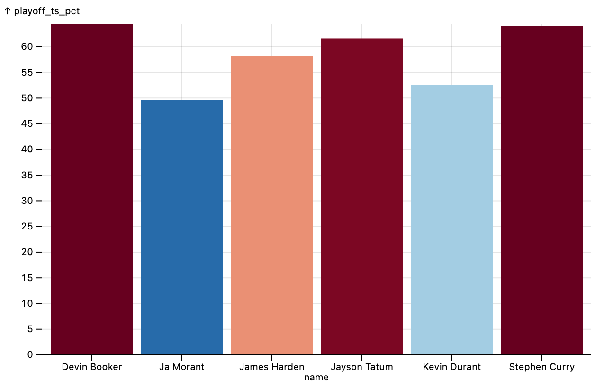

# Typescript Observable plot template

This template repository gets you started with a very simple observable plot that looks like this:

The plot isn't much, but this repository's main job is to set up a typescript environment so that you can start hacking on your graph without any hassle.

## Instructions

1. Clone this repo
2. `npm install`
3. `make watch`

If the install was succesful, `make watch` will open a tab in your browser to a
web page showing an observable plot, and it will watch `src/index.ts` for
changes and rebuild it if there are any.

## Prerequisites

- a modern nodejs environment (tested with version 20)
- gnu make

## Make tasks

I use `make` tasks instead of `npm run` commands because tsc builds can get quite slow once your file gets larger.

This repo has three targets you'll want to use:

- `make all`: build the production file and save it to `dist/index.js`
- `make watch`:
    - watches `src/index.ts` for changes and recompiles it when there are changes (using [nodemon](https://nodemon.io/))
    - serves `index.html` on a web server using [http-server](https://www.npmjs.com/package/http-server)
- `make ci`: run eslint. There's a github action that runs this task for you on pushes

## Tools

- tsc for typechecking
- esbuild for compilation
- eslint for linting
- prettier for formatting
- make for running tasks and managing compilation
- github actions for running lint on code changes
- http-server for serving the site in development
- nodemon for watching files for changes

## Observable Plot Documentation

- https://observablehq.com/@observablehq/plot
- https://github.com/observablehq/plot
- https://observablehq.com/@observablehq/plot-cheatsheets?collection=@observablehq/plot-cheatsheets
