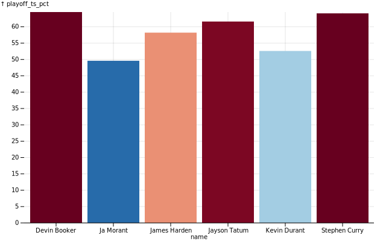

# Typescript Observable plot template

This template repository gets you started with a very simple bar chart that looks like this:

The chart isn't much, but this repository's main job is to set up a typescript environment so that you can start hacking on your graph without any hassle.

Documentation:

- https://observablehq.com/@observablehq/plot
- https://github.com/observablehq/plot
